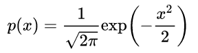
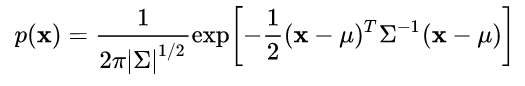

# 习题解答

1、有线性方程 Ax = b，当我们知道A，b，想要求解x时，如何求解？这对 A 和 b 需要哪些条件？提示：从 A 的维度和秩角度来分析。

Ax=b求解参考资料：https://zhuanlan.zhihu.com/p/44114447

假设A是m*n的矩阵，矩阵的秩为r，即rank(A)=r。线性方程组的解分为两部分，Ax=0和Ax=b，两者一道构成通解。一般的求解流程为：先求解Ax=b的特解，再求解Ax=0，最后组合得到通解。

首先求解Ax=b。Ax=b有解的充要条件是rank(A)=rank(A|b)，其中A|b为增广矩阵。以上条件可以理解为Ax=b有解当且仅当b属于A的列空间时成立。当以上条件不成立时，没有精确解，一般采用最小二乘法求解。

其次求解Ax=0。分为四种情况讨论：

1）列满秩（r=n<m），A经过消元后形式为[I ; **0**]，此时只有零解。

2）行满秩（r=m<n），A经过消元后形式为[I F]，此时有无穷多个解。

3）行列都满秩（r=m=n），A经过消元后形式为I，此时有唯一解。可以直接求逆得到x=A^-1*b。

4）行列都不满秩（r<m, r<n），A经过消元后形式为[I F; **0 0**]，此时有无穷多个解。

结合Ax=0和Ax=b的求解，发现以上四种情形中，第2和3种情况下Ax=b必有解，由于行满秩，必能张成n维向量空间，因此b一定属于A的列空间；而第1和4种情况下Ax=b则不一定有解。综上，结论如下：

其中，对于r=n<m的情况，如果限定b≠0，则一定无精确解。

2、高斯分布是什么？它的一维形式是什么样子？它的高维形式是什么样子？

参考资料：https://www.zhihu.com/question/36339816/answer/67043318

- 一维高斯分布：

- 高维高斯分布：

3、你知道C++的类吗?你知道STL吗?你使用过它们吗?

- C++的类：C++的核心特性，用于定义特定程序中的数据类型。
- STL: Standard Template Library，标准模板库，实现了常用的数据结构和算法。

4、你以前怎样书写C++程序？
Visual Studio

5、你知道C++11标准吗？其中哪些新特性你之前听说过或使用过？有没有其他的标准?

C++11新特性包含：

- variadic templates(可变参数模板)
- auto关键字
- range-base for
- ...

其他标准：C++14, 17

6、你知道Linux吗？你有没有至少使用过其中之一(安卓不算)，比如Ubuntu? 
Ubuntu 16.04

7、Linux的目录结构是什么样的？你知道哪些基本命令，比如ls, cat等等？

Linux目录结构：https://www.runoob.com/linux/linux-system-contents.html

重点关注以下几个：

- /etc：存放所有的系统管理所需要的配置文件和子目录，如果你更改了该目录下的某个文件可能会导致系统不能启动。
- /home：用户的主目录，在Linux中，每个用户都有一个自己的目录，一般该目录名是以用户的账号命名的
- /lib：存放着系统最基本的动态连接共享库，其作用类似于Windows里的DLL文件。几乎所有的应用程序都需要用到这些共享库。
- /usr：这是一个非常重要的目录，用户的很多应用程序和文件都放在这个目录下，类似于windows下的program files目录。
- /bin：bin是Binary的缩写, 这个目录存放着最经常使用的命令，比如 ls 就是在/bin/ls 目录下的。
- /usr/bin：系统用户使用的应用程序。
- /usr/src：内核源代码默认的放置目录。
- /var：这是一个非常重要的目录，系统上跑了很多程序，那么每个程序都会有相应的日志产生，而这些日志就被记录到这个目录下，具体在/var/log 目录下，另外mail的预设放置也是在这里。

Linux命令：https://blog.csdn.net/ljianhui/article/details/11100625

- cd：切换目录。
- ls：查看文件与目录，其中ls -a列出全部的文件，连同隐藏文件。
- grep：通常与管道命令一起使用，用于对一些命令的输出进行筛选加工，语法为grep [-acinv] [--color=auto] '查找字符串' filename，联合使用时可以这样使用ls -l | grep -i file。
- find：查找，语法为find [PATH] [option] [action]，比如find / -name passwd # 查找文件名为passwd的文件。
- cp：复制文件，语法为cp [option] file1 file2 (把文件file1复制成文件file2)，或者cp [option] file1 file2 dir (把文件file1、file2复制到目录dir中)，-r ：递归持续复制，用于目录的复制行为；-u ：目标文件与源文件有差异时才会复制。
- mv：移动文件、目录或更名，语法为mv [option] file1 file2 (把文件file1重命名为file2)，或者mv [option] file1 file2 dir (把文件file1、file2移动到目录dir中)。
- rm：删除文件或目录，-r ：递归删除，最常用于目录删除，它是一个非常危险的参数，-f ：就是force的意思，忽略不存在的文件，不会出现警告消息。
- ps：将某个时间点的进程运行情况选取下来并输出，-A ：所有的进程均显示出来。
- kill：向某个工作（%jobnumber）或者是某个PID（数字）传送一个信号，语法为kill -signal PID，signal的常用参数有9：SIGKILL，强制中断一个进程的进行。
- killall：向一个命令启动的进程发送一个信号。
- file：判断接在file命令后的文件的基本数据类型。
- tar：对文件进行打包，默认情况并不会压缩，如果指定了相应的参数，它还会调用相应的压缩程序（如gzip和bzip等）进行压缩和解压。压缩：tar -jcv -f filename.tar.bz2；解压：tar -jxv -f filename.tar.bz2，其中文件名并不定要以后缀tar.bz2结尾。
- cat：查看文本文件的内容。
- chgrp：改变文件所属用户组。
- chown：改变文件的所有者。
- chmod：改变文件的权限，语法为chmod [-R] xyz 文件或目录，其中xyz的常用参数有777（所有人可读可写可执行）。
- vim：文本编辑。
- gcc：把C语言的源程序文件，编译成可执行程序。例如gcc -o test test.c -lm -std=c99，把源文件test.c按照c99标准编译成可执行程序test。
- time：测算一个命令（即程序）的执行时间，比如time ps -A。

8、如何在Ubuntu中安装软件(不打开软件中心的情况下)？这些软件被安装在什么地方？当我只知道模糊的软件名称(比如我想要装一个eigen名称的库)，我应该如何安装它？

安装可以用apt-get install，文档一般在/usr/share，可执行的文件在/usr/bin，配置文件可能安装到了/etc下，lib文件在/usr/lib。

模糊搜索：使用命令 apt-cache search xxxx，先搜索相应的软件包名，例如apt-cache search "^dump$"。

9、花一个小时学习一下vim，因为你迟早会用它。你可以在终端中输入vimtutor，阅读一遍所有内容。我们不需要你非常熟练地操作它，只要在学习本书的过程中使用它键入代码即可。不要在它的插件上浪费时间,不要想着把vim用成IDE,我们只用它做文本编辑的工作。

# 参考文献

- Ax = b：https://zhuanlan.zhihu.com/p/44114447
- 高斯分布：https://www.zhihu.com/question/36339816/answer/67043318
- Linux目录结构：https://www.runoob.com/linux/linux-system-contents.html
- Linux命令：https://blog.csdn.net/ljianhui/article/details/11100625
- Linux安装package路径：https://blog.csdn.net/u013797029/article/details/44492677
- 模糊搜索软件包：https://blog.csdn.net/sunyoop/article/details/78270938