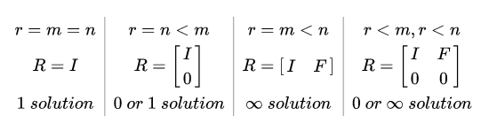

**习题解答**

1、有线性方程 Ax = b,当我们知道A，b，想要求解x时，如何求解？这对 A 和 b 需要哪些条件？提示：从 A 的维度和秩角度来分析。

线性方程组的解分为两部分，Ax=0和Ax=b，两者一道构成通解。一般的求解流程为：先求解Ax=b的特解，再求解Ax=0，最后组合得到通解。

假设A是n*m的矩阵，矩阵的秩为r，即rank(A)=r。

首先求解Ax=b。Ax=b有解的充要条件是rank(A)=rank(A|b)，其中A|b为增广矩阵。以上条件可以理解为Ax=b有解当且仅当b属于A的列空间时成立。当以上条件不成立时，没有精确解，一般采用最小二乘法求解。

其次求解Ax=0。分为四种情况讨论：

1）列满秩（r=m<n），A经过消元后形式为[I ; **0**]，此时只有零解。

2）行满秩（r=n<m），A经过消元后形式为[I F]，此时有无穷多个解。

3）行列都满秩（r=n=m），A经过消元后形式为I，此时有唯一解。可以直接求逆得到x=A^-1*b。

4）行列都不满秩（r<m, r<n），A经过消元后形式为[I F; **0 0**]，此时有无穷多个解。

结合Ax=0和Ax=b的求解，发现以上四种情形中，第2和3种情况下Ax=b必有解，由于行满秩，必能张成n维向量空间，因此b一定属于A的列空间；而第1和4种情况下Ax=b则不一定有解。综上，结论如下：

