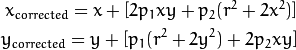

# 习题解答

**1、证明式(10.25)成立。提示：你可能会用到SMW（Sherman-Morrison-Woodbury）公式，参考[76,6]。**

参考资料：[答案来源](https://blog.csdn.net/u012348774/article/details/84065627)

证明思路：根据书中的公式(10.19)代入公式(10.17)整理可得。


**2、对比g2o和Ceres的优化后目标函数的数值。指出为什么两者在Meshlab中效果一样但为何数值却不同。**

Meshlab中的效果是一个整体的观感，而数值是一个具体的度量值。整体观感差不多的情况下，细节的差异不容易被注意到。这可能是两者所用的优化器和参数设置的差异造成的。


**3、给Ceres当中的部分点云进行Schur消元，看看结果会有什么区别。**

参考资料：https://blog.csdn.net/u012348774/article/details/84065627

Ceres有设置消元顺序的函数，具体来说，只要将ceresBundle.cpp文件的SetOrdering函数中的空间点消元部分代码：


```cpp
for(int i = 0; i < num_points; ++i)
       ordering->AddElementToGroup(points + point_block_size * i, 0);
```

改成


```cpp
for(int i = 0; i < num_points; ++i)
{
  if(i%N==0)
  {
    ordering->AddElementToGroup(points + point_block_size * i, 0);
  }
  else
  {
    ordering->AddElementToGroup(points + point_block_size * i, 1);
  } 
}
```

即可完成对1/N的点云进行Schur消元。


**4、证明S矩阵为半正定矩阵。**

证明思路：由于S = B - E C^-1 E^T，其中B和C都是对角块矩阵，则E C^-1 E^T也是对角块矩阵，最后得到的S在对角线上都有值。类比协方差矩阵为半正定矩阵，可能可以推知S的半正定性。（具体证明过程待补充）


**5、阅读[28]，看看g2o对核函数是如何处理的。与Ceres中的Loss function有何联系？**

g2o中的kernel是通过g2o::RobustKernelHuber类来定义的，而Ceres是在problem.AddResidualBlock中作为第二项参数传入，比如new CachyLoss(0.5)。


**6、在两个示例中,我们优化了相机位姿、以 f, k1, k2 为参数的相机内参以及路标点。 请考虑使用第五章介绍的完整的相机模型进行优化，即，至少考虑 fx , fy , p1 , p2 , k1 , k2 这些量。修改现在的Ceres和g2o程序以完成实验。**

参考资料：http://www.bubuko.com/infodetail-1274723.html

由于切向畸变的定义为：



假设我们先去除径向畸变，再去除切向畸变。那么只要按照公式，在projection.h文件的CamProjectionWithDistortion函数中的以下代码：

```cpp
predictions[0] = focal * distortion * xp;
predictions[1] = focal * distortion * yp;
```

后加上

```cpp
predictions[0] =  predictions[0] + T(2.0)*p1*predictions[0]*predictions[1] + p2*(r2+T(2.0)*predictions[0] *predictions[0]);
predictions[1] = predictions[1] + T(2.0)*p2*predictions[0]*predictions[1] + p1*(r2+T(2.0)*predictions[1] *predictions[1]);
```

即可实现切向畸变的标定。


# 参考文献

- Kalman滤波公式证明：https://blog.csdn.net/u012348774/article/details/84065627
- Ceres部分点云Schur消元：https://blog.csdn.net/u012348774/article/details/84065627
- 切向畸变：http://www.bubuko.com/infodetail-1274723.html