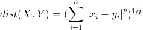

# 习题解答

**1、请书写计算PR曲线的小程序。用MATLAB或Python可能更加简便一些，因为它们擅长作图。**

参考资料：https://blog.csdn.net/u013044310/article/details/89890626

使用Python绘制PR曲线，关键在于将数据进行排序，从而方便设置阈值计算precision和recall值，具体代码如下：

```python
import numpy as np
import matplotlib
matplotlib.use('TkAgg')
import matplotlib.pyplot as plt

def PR_curve(y, prob):
    # TP+FN
    positive = np.sum(y == 1)
    
    # 对预测概率进行排序，从而方便计算不同阈值时的数据
    prob_sort = np.sort(prob)[::-1]
    index = np.argsort(prob)[::-1]
    y_sort = y[index]

    precision, recall = [], []
    for i, _ in enumerate(prob_sort):
        # 给定初值，同时防止i=0作为分母
        if i==0:
            precision.append(1)
            recall.append(0)
        else:
            # :i表示0~i-1，因此认为是一个累加的过程
            precision.append(np.sum(y_sort[:i] == 1) / i)     # 所有回环中确实是真实回环的概率
            recall.append(np.sum(y_sort[:i] == 1) / positive) # 所有真实回环中被正确检测出来的概率

    plt.plot(recall, precision)
    plt.title('Precision-Recall Curve')
    plt.xlim([-0.01, 1.01]) # 设置显示范围
    plt.ylim([-0.01, 1.01])
    plt.ylabel('Precision')
    plt.xlabel('Recall')
    plt.show()

data_size = 50
y = np.random.randint(0, 2, size=data_size) # 随机产生0，1两个类别
prob = np.random.choice(np.arange(0.1, 1, 0.001), data_size) # 随机给定概率
PR_curve(y, prob)
```

绘制的PR曲线如图：


由于以上的数据是随机生成的，因此PR曲线与常见的曲线不相似。此外，一般需要对曲线进行平滑处理，才能获得更加光滑的结果。


**2、验证回环检测算法，需要有人工标记回环的数据集，例如[94]。然而人工标记回环是很不方便的，我们会考虑根据标准轨迹计算回环。即，如果轨迹中有两个帧的位姿非常相近，就认为它们是回环。请你根据TUM数据集给出的标准轨迹，计算出一个数据集中的回环。这些回环的图像真的相似吗？**

理论上位姿非常相近，即表示位置和相机姿态都相近，可以认为是同一个地方，不过实践中应该要取决于轨迹的准确性等因素。（具体待实践）


**3、学习DBoW3或DBoW2库，自己寻找几张图片，看能否从中正确检测出回环。**

参考资料：[泡泡机器人文章](https://mp.weixin.qq.com/s?__biz=MzI5MTM1MTQwMw==&mid=2247487947&idx=1&sn=a161d5ba005adabbfef23ee823c3f34b&chksm=ec10afcfdb6726d9460e3992357b93a50fb622a805c785a9322d7cafb6f8d7d0b02494206fbd&mpshare=1&scene=25&srcid=0120tujPrzQBRJvOMRlHZuAr&pass_ticket=DyCv5iDYNGzqu%2FG5eHjGG4I5gZSFV%2B4a6kb08nDUOcc%3D#wechat_redirect)

DBoW3是DBoW2的增强版，是一个开源的C++库，用于给图像特征排序，并将图像转化成视觉词袋表示。它采用层级树状结构将相近的图像特征在物理存储上聚集在一起，创建一个视觉词典。DBoW3还生成一个图像数据库，带有顺序索引和逆序索引，可以使图像特征的检索和对比非常快。

DBoW3有两个主要的类：Vocabulary和Database。视觉词典将图像转化成视觉词袋向量，图像数据库对图像进行索引，其中图像数据库由视觉字典树、逆序索引和顺序索引组成，逆序索引存储了每幅图像中视觉单词的权重，顺序索引存储了图像特征和特征相关联的树节点（即视觉单词）。


**4、调研相似性评分的常用度量方式，哪些比较常用？**

参考资料：

- https://blog.csdn.net/yixianfeng41/article/details/61917158
- https://www.zhihu.com/question/19734616

相似性评分的常用度量：

- 欧氏距离：衡量的是多维空间中各个点之间的绝对距离；
- 曼哈顿距离：衡量的是方格线上点的距离；
- 明可夫斯基距离（Minkowski distance）：欧氏距离的扩展，公式定义如下。可见p=1为曼哈顿距离，p=2为欧氏距离，p=∞为切比雪夫距离；



- 余弦相似度：衡量的是向量空间中两个向量夹角的余弦值，公式定义如下；


- 杰卡德距离（Jaccard Similarity）：衡量的是符号度量或布尔值度量的个体间的相似度，也称IoU（Intersection over Union）；
- 皮尔森相关系数（Pearson Correlation Coefficient）：衡量的是数据经过标准化后的相似度，公式定义如下。对比公式可以发现，在数据标准化(μ=0, sigma=1)后，Pearson相关性系数、Cosine相似度、欧式距离的平方可认为是等价的。


**5、Chow-Liu树是什么原理？它是如何被用于构建字典和回环检测的？**

参考资料：

- 基于特征点法和直接法 VSLAM 的研究现状，邹雄等，计算机应用研究，2018年11月
- http://www.bewindoweb.com/232.html

Chow-Liu树旨在解决根据有限的数据集来估计整体n维联合概率分布的问题。通过建模成寻找最优依赖树的方式来实现，具体待研究。FAB-MAP在贝叶斯框架下, 采用Chou-Liu tree估计单词的概率分布，从而完成大规模环境下的闭环检测问题。


**6、阅读[106]，除了词袋模型，还有哪些用于回环检测的方法？**

参考资料：

- Williams, Brian, et al. "A comparison of loop closing techniques in monocular SLAM." Robotics and Autonomous Systems 57.12 (2009): 1188-1197.
- https://blog.csdn.net/zhengbq_seu/article/details/81873857

回环检测主要有三类方法：

- 地图到地图：在两个子地图中的特征之间寻找对应关系，比如使用可变尺度、几何兼容的分支定界（GCBB）算法寻找两个子地图共有的最大兼容特征集，同时考虑特征的外观及其相对几何位置来实现单目SLAM的回环检测；
- 图像到图像：在来自摄像机的最新图像和先前看到的图像之间寻找对应关系，这里的关键是找到distinctive的特征；
- 图像到地图：在摄像机的最新帧和地图中的特征之间寻找对应关系，比如找到潜在的图像-地图对应关系来映射当前图像中的特征，然后使用基于Ransac的三点姿态估计算法来确定相机相对于地图的位姿。


# 参考文献

- PR曲线：https://blog.csdn.net/u013044310/article/details/89890626
- DBoW：https://mp.weixin.qq.com/s?\_\_biz=MzI5MTM1MTQwMw==&mid=2247487947&idx=1&sn=a161d5ba005adabbfef23ee823c3f34b&chksm=ec10afcfdb6726d9460e3992357b93a50fb622a805c785a9322d7cafb6f8d7d0b02494206fbd&mpshare=1&scene=25&srcid=0120tujPrzQBRJvOMRlHZuAr&pass_ticket=DyCv5iDYNGzqu%2FG5eHjGG4I5gZSFV%2B4a6kb08nDUOcc%3D#wechat_redirect
- 相似度评分：https://blog.csdn.net/yixianfeng41/article/details/61917158
- 皮尔森相关系数：https://www.zhihu.com/question/19734616
- Chow-Liu树：基于特征点法和直接法 VSLAM 的研究现状，邹雄等，计算机应用研究，2018年11月
- Chow-Liu树：http://www.bewindoweb.com/232.html
- 回环检测：Williams, Brian, et al. "A comparison of loop closing techniques in monocular SLAM." Robotics and Autonomous Systems 57.12 (2009): 1188-1197.
- 回环检测：https://blog.csdn.net/zhengbq_seu/article/details/81873857