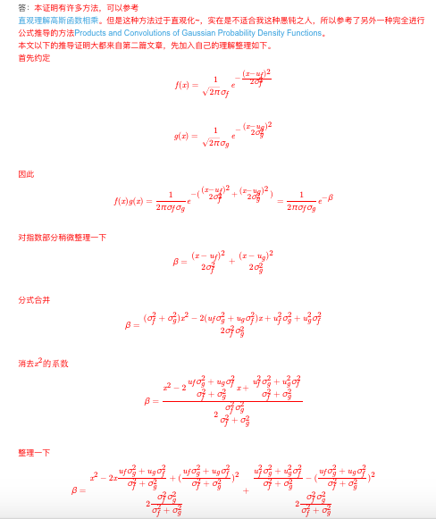
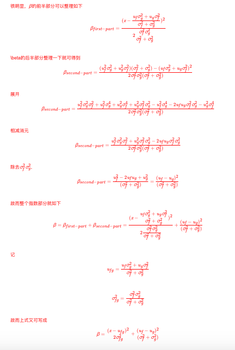
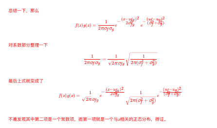
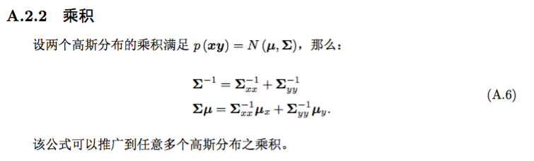
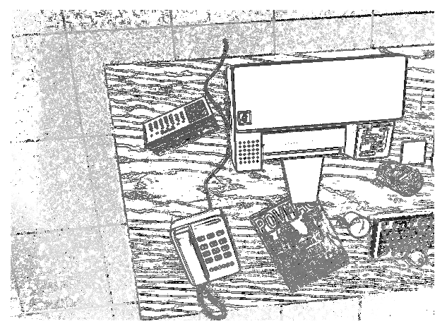
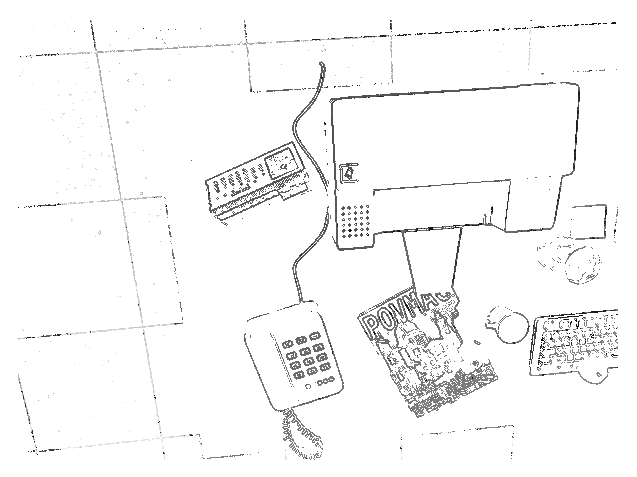
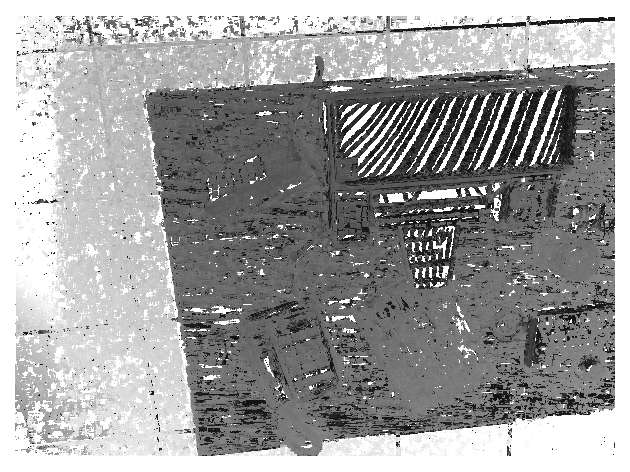
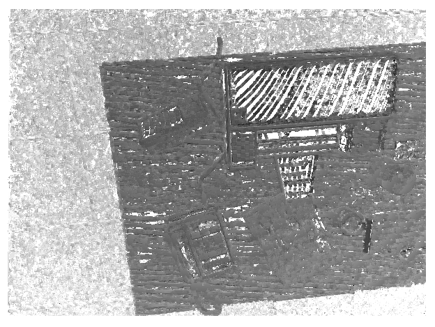

# 习题解答

**1、推导式(13.6)。**

参考资料：[答案来源](https://blog.csdn.net/u012348774/article/details/84568737)

证明思路一：直接相乘化简即可得证；







证明思路二：应用附录里的高斯分布相乘的性质（A.6）易得。




**2、把本讲的稠密深度估计改成半稠密，你可以先把梯度明显的地方筛选出来。**

参考资料：[答案来源](https://www.cnblogs.com/cc111/p/9688441.html)

代码思路：由于需要将梯度明显的地方筛选出来，因此加入判断梯度值大小的语句，实现上只需要将dense_mapping中update函数的for循环最开始，即“//遍历每个像素”前面加上以下代码，此处设置SEMI\_SPARSE作为判断稠密估计还是半稠密估计的FLAG：

```cpp
// 将稠密深度估计改成半稠密深度估计，把梯度明显的地方筛选出来
if ( SEMI_SPARSE ){
    Eigen::Vector2d gradient(
        ref.ptr<uchar>(y)[x+1]-ref.ptr<uchar>(y)[x-1],
        ref.ptr<uchar>(y+1)[x]-ref.ptr<uchar>(y-1)[x]);
    if(gradient.norm()<10) continue; // 50
}
```

其中10和50是可以人为设置的阈值，用来筛选梯度，以下给出两种阈值下的深度估计结果：

当设置梯度阈值为10时：



当设置梯度阈值为50时：



在运行过程中发现，设置阈值为50时系统很快就收敛了，设置阈值为10时则慢很多。这符合逻辑，阈值越大，表示对梯度值的要求越高，因此符合要求的点越少，计算复杂度低，因此收敛快；同时，阈值越大，越是边缘的地方才估计深度值。

以上代码具体可见ch13/dense_monocular/dense\_mapping.cpp。


**3、把本讲演示的单目稠密重建代码，从正深度改成逆深度，并添加仿射变换。你的实验效果是否有改进?**

#### 从正深度改成逆深度

由于假设逆深度符合高斯分布，因此在实现上设定逆深度的均值为原先正深度的倒数，逆深度的方差的初值则维持与正深度的一致，因为方差最终会随着深度值的更新而收敛，因此不对方差的初值做特殊设置。与原始的正深度代码相比，为了改成逆深度主要有两处需要修改：

- epipolar search环节：确定epipolar line的两个端点时，需要左右取三倍方差的范围；
- update depth filter环节：涉及到了高斯融合，进行深度值更新。

代码修改如下，此处设置INVERSE\_DEPTH作为判断正深度还是逆深度的FLAG：

- epipolarSearch函数：

```cpp
double d_max, d_min;
if ( INVERSE_DEPTH ){
    // 这里假设逆深度的均值初值为1/depth_mu，方差均值为depth_cov
    // 方差之所以与之前一样是因为，此处设定为初值，最后由于有深度的更新会慢慢收敛
    // 因此方差的初值设定为具体什么值显得不是很重要
    double in_d_min = 1/depth_mu - 3*depth_cov, in_d_max = 1/depth_mu + 3*depth_cov;
    if ( in_d_min<0.01 ) in_d_min = 0.01; // 保证逆深度不为负
    d_max = 1/in_d_min;
    d_min = 1/in_d_max;
    if( d_min<0.1 ) d_min = 0.1;
}
else{
    d_min = depth_mu-3*depth_cov, d_max = depth_mu+3*depth_cov;
    if ( d_min<0.1 ) d_min = 0.1;
}
```

- updateDepthFilter函数：

```cpp
if ( INVERSE_DEPTH ){
    // 以下与均值相关的变量均取倒数，与方差相关的变量维持不变
    double d_cov = 1/p_prime - 1/depth_estimation; // 逆深度的像素扰动
    double d_cov2 = d_cov*d_cov;

    // 高斯融合
    double mu = depth.ptr<double>( int(pt_ref(1,0)) )[ int(pt_ref(0,0)) ]; // 读取depth值
    double sigma2 = depth_cov.ptr<double>( int(pt_ref(1,0)) )[ int(pt_ref(0,0)) ]; // 读取depth的协方差值

    double mu_fuse = (d_cov2/mu+sigma2/depth_estimation) / ( sigma2+d_cov2); // 均值的融合
    double sigma_fuse2 = ( sigma2 * d_cov2 ) / ( sigma2 + d_cov2 ); // 方差的融合
    
    depth.ptr<double>( int(pt_ref(1,0)) )[ int(pt_ref(0,0)) ] = 1/mu_fuse; // 均值的更新
    depth_cov.ptr<double>( int(pt_ref(1,0)) )[ int(pt_ref(0,0)) ] = sigma_fuse2; // 方差的更新
}
else{
    double d_cov = p_prime - depth_estimation; // depth_estimation就是p的norm
    double d_cov2 = d_cov*d_cov; // observation的协方差
    
    // 高斯融合
    double mu = depth.ptr<double>( int(pt_ref(1,0)) )[ int(pt_ref(0,0)) ]; // 读取depth值
    double sigma2 = depth_cov.ptr<double>( int(pt_ref(1,0)) )[ int(pt_ref(0,0)) ]; // 读取depth的协方差值
    
    double mu_fuse = (d_cov2*mu+sigma2*depth_estimation) / ( sigma2+d_cov2); // 均值的融合
    double sigma_fuse2 = ( sigma2 * d_cov2 ) / ( sigma2 + d_cov2 ); // 方差的融合
    
    depth.ptr<double>( int(pt_ref(1,0)) )[ int(pt_ref(0,0)) ] = mu_fuse; // 均值的更新
    depth_cov.ptr<double>( int(pt_ref(1,0)) )[ int(pt_ref(0,0)) ] = sigma_fuse2; // 方差的更新
}
```

对比迭代30次后的结果图：

使用正深度



使用逆深度



改成逆深度后，算法的运行速度有所提升，最后收敛时地面的深度估计更加均匀，但是与使用正深度一样，没有纹理的打印机表面等仍会出现带状的错误估计。颜色上使用逆深度会比较浅，可能是可视化的效果问题，因为使用逆深度后地面的深度估计变得均匀，几乎没有纯白色的部分，因此对比度变得不强烈。


#### 添加仿射变换

目前的思路是直接对参考帧的像素点加上小的平移量，然后根据参考帧与当前帧的位姿关系投影到当前帧，获得对应的像素值，用于计算NCC值。但是这部分代码和推导上仍有问题，待解决，求大神指导。


以上代码具体可见ch13/dense_monocular/dense\_mapping.cpp。


**4、你能论证如何在八叉树中进行导航或路径规划吗？**

导航与路径规划的本质是如何在地图上实现从A点移动到B点，因此主要解决定位、规划和碰撞检测三个问题。前两个都有成熟的算法可以应用，对于八叉树地图来说，主要难点在于如何针对空间环境的八叉树结构设计碰撞检测算法。由于八叉树地图将空间环境进行迭代的划分，当划分层级足够多时，地图的精度就可以达到很高，足以实现小物体的建模，从而可以根据空间环境的occupancy情况设计对应的碰撞检测算法，最终实现导航或路径规划。


**5、研究[120]，探讨TSDF地图是如何进行位姿估计和更新的。它和我们之前讲过的定位建图算法有何异同？**

参考资料：https://www.cnblogs.com/zonghaochen/p/8325905.html

#### TSDF地图的位姿估计

文献120为KinectFusion，其位姿估计是通过ICP的方式实现的。ICP分为point-to-point和point-to-plane两种方式，前者即为简单的根据点与点之间对应关系来估计位姿，后者则在估计位姿时加入了法向量，即要把点到点的距离向法向量投影，可以实现更好的精度。这里的ICP算法即采用了point-to-plane的方式，示意图见下方（具体待研究）：


#### TSDF地图的更新

TSDF的更新是通过加权平均的方式实现的，具体为对于每一个新的帧，获得其SDF值，同时确定权重，具体方法为voxel越正对着相机，越靠近相机，权重越大。具体算法实现流程见下方（待研究）：


#### 与之前的定位建图算法的异同

- 相同点：都是通过融合过去和当前帧的数据进行更新；
- 不同点：Octomap是通过高斯分布相乘的方式进行融合更新，这里是通过加权平均的方式；此外两者的表征不同，Octomap是以八叉树来表征环境，这里则是用TSDF的形式（空间点与表面的关系）来建模环境的（以上为目前的想法，内容待研究确认）。


**6、研究均匀——高斯混合滤波器的原理与实现。**

参考资料：https://blog.csdn.net/xiaoxiaowenqiang/article/details/80720767

均匀-高斯混合滤波器是高斯滤波器的改进版，用于获得更好的深度值，在SVO中即采用了这种滤波器。其原理为：在之前单纯假设深度符合高斯分布的基础上，加入了噪声的估计，并假设噪声符合均匀分布；同时将问题建模成有噪声的多传感器数据融合问题，因为最后的深度图是由n张图像获得的，可以看作来自于n个深度传感器。因此假设能获得好的测量值的概率为pi，之后使用贝叶斯方法不断更新这个模型，让点的深度（也就是正态分布中的均值参数）和好的测量值的比例pi收敛到真实值。（具体待研究，可以看SVO的论文）


# 参考文献

- 高斯分布相乘：https://blog.csdn.net/u012348774/article/details/84568737
- 筛选梯度：https://www.cnblogs.com/cc111/p/9688441.html
- TSDF：https://www.cnblogs.com/zonghaochen/p/8325905.html
- 均匀-高斯混合滤波器：https://blog.csdn.net/xiaoxiaowenqiang/article/details/80720767