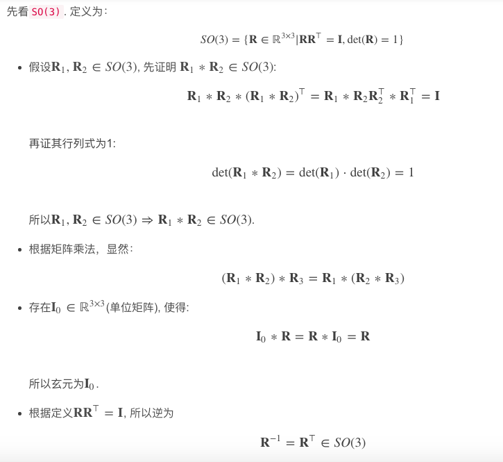
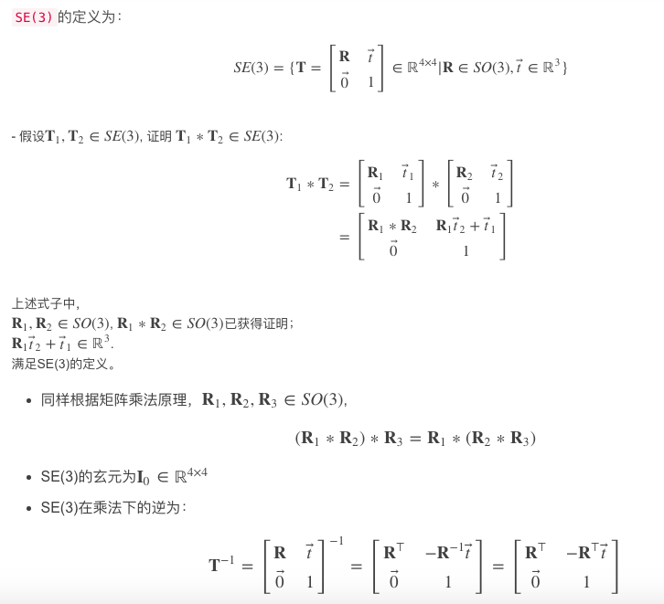
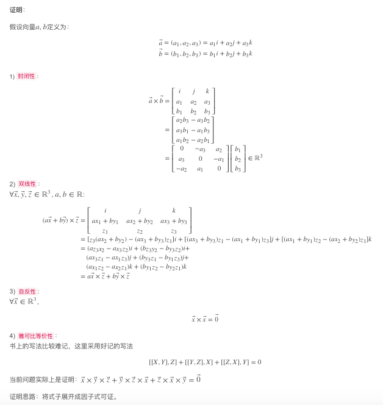
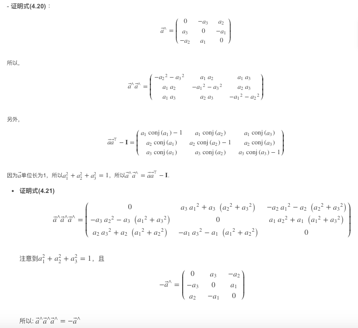
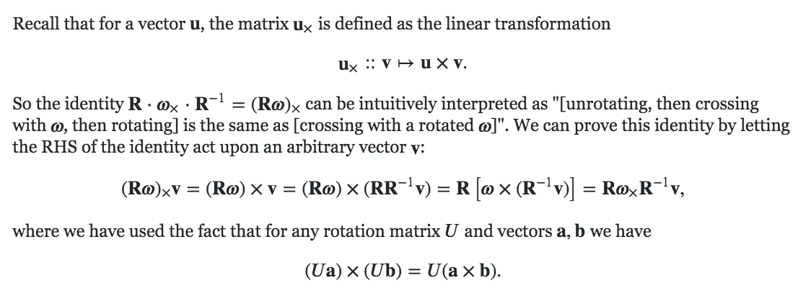
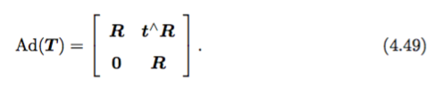

# 习题解答

1、验证 SO(3)、SE(3) 和 Sim(3) 关于乘法成群。

证明过程来源：https://blog.csdn.net/luohuiwu/article/details/80719357

证明思路：首先写出SO(3), SE(3), Sim(3)的定义，接着按照群的四个要求一一验证，其中运用定义和矩阵乘法、求逆等的知识即可证明。

对于SO(3)：

对于SE(3)：其中验证组合律时应为(T1 * T2 ) * T3 = T1 * ( T2 * T3 )。

对于Sim(3)：受限于篇幅略去。

2、验证 (R^3, R, ×) 构成李代数。

证明来源：https://blog.csdn.net/luohuiwu/article/details/80719357

证明思路：根据李代数的四点定义，结合叉乘的性质即可一一证明。

其中，由于叉乘的结果是一个行列式，因此严谨来说应该将叉乘结果的形式从[...]改为|...|。

3、验证 so(3) 和 se(3) 满足李代数要求的性质。

证明来源：https://blog.csdn.net/luohuiwu/article/details/80719090

证明思路：根据李代数的四点定义，结合叉乘的性质和矩阵乘法的性质即可一一证明。

其中，最开始定义反对称矩阵时，应该为**Φ**=φ^，而不是下三角符号。

4、验证性质（4.20）和（4.21）。

证明来源：https://blog.csdn.net/luohuiwu/article/details/80719357

证明思路：利用矩阵乘法展开后化简得证。

5、证明：R p∧ R^T = (Rp)∧。

方法一：借助外界变量间接证明

证明来源：https://blog.csdn.net/jiahao62/article/details/80655542，https://math.stackexchange.com/questions/2190603/derivation-of-adjoint-for-so3

证明思路：很巧妙的方法，可以通过右乘任意一个向量v来证明，用到了叉乘与反对称矩阵的变换。

方法二：利用矩阵乘法展开直接证明

证明来源：https://blog.mengoreo.cn/post/vslam_ch4/

证明思路：将R和p都定义出来，老老实实展开算后化简得证。

6、证明：R exp(p∧) R^T = exp((Rp)∧)。该式称为 SO(3) 上的伴随性质。同样的，在 SE(3) 上亦有伴随性质：

其中：

证明来源：https://blog.mengoreo.cn/post/vslam_ch4/

证明思路：通过罗德里格斯公式进行展开再化简得证，很巧妙！

7、仿照左扰动的推导，推导 SO(3) 和 SE(3) 在右扰动下的导数。

证明来源：https://blog.mengoreo.cn/post/vslam_ch4/

证明思路：与书中类似，注意相乘几项的左右位置即可

其中，最后取极限是分别对delta_p和delta_fai取极限，因此得到的是两项。里面还会用到一次叉乘两项顺序互换，需要加一个负号。

8、搜索cmake的find_package指令是如何运作的。它有哪些可选的参数？为了让cmake找到某个库，需要哪些先决条件？

参考链接：https://blog.csdn.net/u012348774/article/details/83652191#comments，https://cmake.org/cmake/help/v3.14/command/find_package.html

有两种find_package的方式：

- “Module” mode：CMake searches for a file called Find<PackageName>.cmake. The file is first searched in the CMAKE_MODULE_PATH, then among the Find Modules provided by the CMake installation. If the file is found, it is read and processed by CMake. It is responsible for finding the package, checking the version, and producing any needed messages. Some find-modules provide limited or no support for versioning; check the module documentation. 简单来说，通过CMAKE\_MODULE\_PATH下的Find<PackageName>.cmake文件确定头文件和库文件的位置，给XXX\_INCLUDE\_DIRS和XXX\_LIBRARIES两个变量赋值。
- “Config” mode：The command searches for a file called <PackageName>Config.cmake or <lower-case-package-name>-config.cmake for each name specified. 简单来说，通过<PackageName>_DIR的xxxConfig.cmake文件确定头文件和库文件的位置，给XXX\_INCLUDE\_DIRS和XXX\_LIBRARIES两个变量赋值。

两者的关系：The above signature selects Module mode. If no module is found the command falls back to Config mode, described below. This fall back is disabled if the MODULE option is given. 即在没有给定MODULE参数的情况下，首先使用Module mode，找不到则使用Config Mode。

可用的参数：[version] [EXACT] [QUIET] [MODULE] [REQUIRED]等，具体解释请见官方文档。

# 参考文献

- 乘法成群：https://blog.csdn.net/luohuiwu/article/details/80719357
- 李代数：https://blog.csdn.net/luohuiwu/article/details/80719357
- 李代数：https://blog.csdn.net/luohuiwu/article/details/80719090
- 验证性质：https://blog.csdn.net/luohuiwu/article/details/80719357
- 证明叉乘关系：https://blog.csdn.net/jiahao62/article/details/80655542
- 证明叉乘关系：https://math.stackexchange.com/questions/2190603/derivation-of-adjoint-for-so3
- 证明叉乘关系：https://blog.mengoreo.cn/post/vslam_ch4/
- 伴随性质：https://blog.mengoreo.cn/post/vslam_ch4/
- 右扰动下的导数：https://blog.mengoreo.cn/post/vslam_ch4/
- find_package：https://blog.csdn.net/u012348774/article/details/83652191#comments
- find_package：https://cmake.org/cmake/help/v3.14/command/find_package.html
