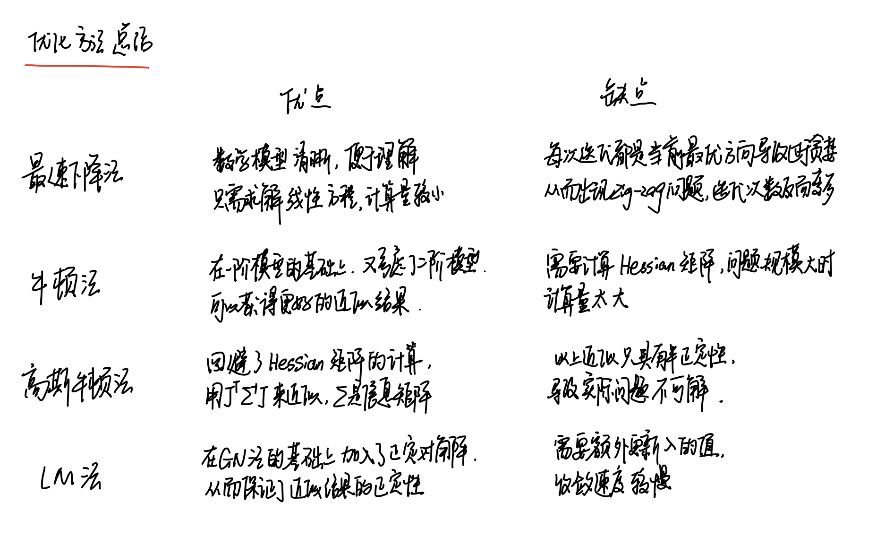

# 习题解答

1、证明线性方程 Ax = b 当系数矩阵 A 超定时，最小二乘解为 x = (A^T A)^−1 A^T b。

对于m\*n的矩阵A来说，当A矩阵超定时，表示rank(A)=n<m，即线性方程的方程数多于未知数个数，且满足列满秩，此时无精确解，一般采用最小二乘法求解。常用的方法为在等式两边各自左乘A^T。由于矩阵A满足列满秩，因此A^T*A是n\*n满秩矩阵，符合可逆条件。故可以求得最小二乘解为以上形式。

2、调研最速下降法、牛顿法、GN和LM各有什么优缺点。除了我们举的Ceres库和g2o库，还有哪些常用的优化库？你可能会找到一些MATLAB上的库。

参考资料：

- https://blog.csdn.net/jiahao62/article/details/80655542
- https://blog.csdn.net/u011584941/article/details/44560409
- https://blog.csdn.net/zhubaohua_bupt/article/details/74973347

3、为什么GN的增量方程系数矩阵可能不正定？不正定有什么几何含义？为什么在这种情况下解就不稳定了?

参考资料：

- https://blog.csdn.net/chduan_10/article/details/78075112
- https://blog.csdn.net/wangshuailpp/article/details/80308021

GN的增量方程系数矩阵即为近似Hessian矩阵的J^T*∑^-1\*J，该矩阵是半正定的，因此可能不正定。其几何含义可以将多元函数的Hessian矩阵类比一元函数的二阶导，对于一元函数来说，其二阶导非负，类比过来，可以得到Hessian矩阵半正定。如果不能保证二阶导的恒为正的性质，则意味着无法获得极大值/极小值，只能得到鞍点；同理，当增量方程的系数矩阵无法保证正定性时，可能出现奇异矩阵和病态的情况，此时系统不稳定。

4、DogLeg是什么？它与GN和LM有何异同？请搜索相关的材料，例如http://www.numerical.rl.ac.uk/people/nimg/course/lectures/raphael/lectures/lec7slides.pdf。

参考资料：https://blog.csdn.net/stihy/article/details/52737723?hmsr=toutiao.io&utm_medium=toutiao.io&utm_source=toutiao.io

DogLeg是一种GN和最速下降法的混合方法，与LM方法使用阻尼项不同，DogLeg选择了trust region。具体待研究。

5、阅读 Ceres的教学材料以更好地掌握它的用法：http://ceres-solver.org/tutorial.html。  mark

6、阅读g2o自带的文档，你能看懂它吗？如果还不能完全看懂,请在第十、十一两讲之后回来再看。 mark

7、请更改曲线拟合实验中的曲线模型，并用Ceres和g2o进行优化实验。例如，你可以使用更多的参数和更复杂的模型。

# 参考文献

- 优化方法：https://blog.csdn.net/jiahao62/article/details/80655542
- 优化方法：https://blog.csdn.net/u011584941/article/details/44560409
- 优化方法：https://blog.csdn.net/zhubaohua_bupt/article/details/74973347
- 增量矩阵：https://blog.csdn.net/chduan_10/article/details/78075112
- 增量矩阵：https://blog.csdn.net/wangshuailpp/article/details/80308021
- DogLeg：https://blog.csdn.net/stihy/article/details/52737723?hmsr=toutiao.io&utm_medium=toutiao.io&utm_source=toutiao.io