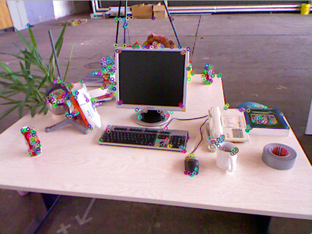
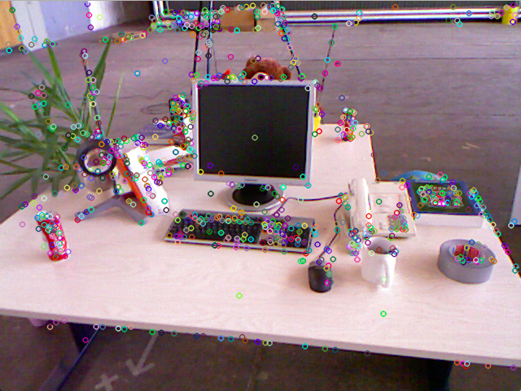
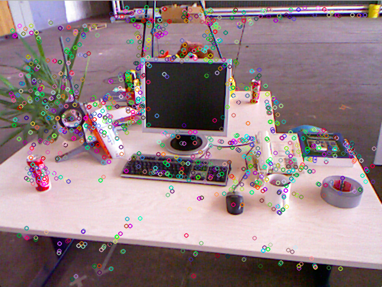

# 习题解答

**1、除了本书介绍的ORB特征点外，你还能找到哪些其他的特征点？请说说SIFT或SURF的原理，对比它们与ORB之间的优劣。**

特征点：FAST, Harris, SIFT, SURF

##### SIFT特征提取和匹配的具体步骤：

参考资料：

- https://blog.csdn.net/dcrmg/article/details/52577555
- https://blog.csdn.net/dcrmg/article/details/52561656

1）构建多尺度高斯差分金字塔（DoG）：基本思想为利用降采样和高斯模糊来构建N组、每组M层的高斯金字塔，再在每一组内相邻层相减得到DoG图，从而实现了**尺度不变性**。具体请见[博客](https://blog.csdn.net/dcrmg/article/details/52561656)。

2）根据DoG图检测关键点：对于中心点寻找极值点，通过比较DoG当前图和同一组的上下相邻图的3*3邻域获得。

3）精确化关键点位置：筛选局部极值点，利用非极大值抑制去除不稳定和错误检测出的极值点，同时由于使用了高斯模糊的图，需要获得关键点的精确位置。

4）获得关键点主方向信息：计算以关键点为中心的邻域内所有点的梯度方向，其中梯度方向定义如下。对这些梯度方向归结到36个方向内，每个方向代表了10°的范围，然后累计落到每个方向内的关键点个数，以此生成梯度方向直方图。将梯度方向直方图中纵坐标最大的项代表的方向分配给当前关键点作为主方向，若在梯度直方图中存在一个相当于主峰值80%能量的峰值，则将这个方向认为是关键点的辅方向。从而实现了**旋转不变性**。


5）构建关键点描述子：对关键点周围像素区域分块，每块的所有像素点的梯度做高斯加权（权重根据离关键点距离确定），每块最终取8个方向，即可以生成N\*N\*8维度的向量，以这N\*N\*8维向量作为数学描述。示意图如下：


6）特征点匹配：通过计算两组特征点的N\*N\*8维（常用512或128维）的关键点的欧式距离实现。当欧式距离小于设定的阈值时，可以判定为匹配成功。

##### SURF特征提取和匹配的具体步骤：

参考资料：

- https://blog.csdn.net/songzitea/article/details/16986423
- https://blog.csdn.net/app_12062011/article/details/51655919
- https://blog.csdn.net/dcrmg/article/details/52601010

1）构建Hessian矩阵进行特征点的提取：基本思想为利用盒装滤波（高斯二阶滤波器）近似Hessian矩阵，并用积分图查找来加速Hessian矩阵行列式的计算，根据行列式取值正负来判别该点是不是极点值。其中积分图的定义为图像左上角到任意点相应对角线区域灰度值的总和，其加速原理为一旦积分图计算好了，计算图像内任何矩形区域的像素值的和只需要三个加减法计算，示意图如下：


2）构建多尺度Hessian行列式图：与SIFT不同，SURF构建的N组、每组M层的金字塔图片大小一直不变，仅改变filter的大小。

3）根据Hessian行列式图检测关键点并精确化关键点位置：与SIFT类似。

4）获得关键点主方向信息：在SURF中，不统计其梯度直方图，而是统计特征点领域内的Haar小波特征，其中Haar小波本质为求梯度信息。统计特征点领域的60度扇形内的Haar小波响应总和，并做高斯加权，遍历整个圆形区域，选择最长矢量的方向为该特征点的主方向，示意图如下：


5）构建关键点描述子：根据第4步检测出来的主方向构建正方形邻域，分为16个子区域，每个子区域统计25个像素的水平方向和垂直方向的Haar小波特征，具体为水平方向值之和、垂直方向值之和、水平方向绝对值之和以及垂直方向绝对值之和4个方向，因此一共有4\*4\*4=64维向量作为Surf特征的描述子。

6）特征点匹配：在SIFT的基础上，还加入了Hessian矩阵迹的判断，如果两个特征点的矩阵迹正负号相同，代表这两个特征具有相同方向上的对比度变化，如果不同，说明这两个特征点的对比度变化方向是相反的，即使欧氏距离为0，也直接予以排除。

##### 与ORB的优劣势比较：

参考资料：https://blog.csdn.net/zilanpotou182/article/details/66478915

计算速度：            ORB>>SURF>>SIFT（各差一个量级）

旋转鲁棒性：        SURF>ORB~SIFT（表示差不多）

模糊鲁棒性：        SURF>ORB~SIFT

尺度变换鲁棒性： SURF>SIFT>ORB（ORB并不具备尺度变换性）

所以结论就是，如果对计算实时性要求非常高，可选用ORB，但基本要保证正对拍摄；如果对实时性要求稍高，可以选择SURF；基本不用SIFT。


**2、设计程序，调用OpenCV中的其他种类特征点。统计在提取1000个特征点时，在你的机器上所用的时间。**

参考资料：https://www.cnblogs.com/cc111/p/9457319.html

```cpp
// Feature extraction time cost
Mat img_1 = imread(argv[1],CV_LOAD_IMAGE_COLOR);
vector<KeyPoint> keypoints_1; //关键点
Mat outImg; // imshow
    
// ORB feature extraction
chrono::steady_clock::time_point ORB_t1=chrono::steady_clock::now();
Ptr<FeatureDetector> orb_detector = ORB::create(1000);
orb_detector->detect ( img_1,keypoints_1 );
chrono::steady_clock::time_point ORB_t2 = chrono::steady_clock::now();
chrono::duration<double> ORB_time_used = chrono::duration_cast<chrono::duration<double> >( ORB_t2-ORB_t1 );
cout<<"extract keypoints of ORB costs: "<<ORB_time_used.count()<<" seconds."<<endl;
cout<<"ORB keypoint number = "<<keypoints_1.size()<<endl;
drawKeypoints(img_1,keypoints_1,outImg,Scalar::all(-1),DrawMatchesFlags::DEFAULT); 
imshow("1.png的ORB特征点",outImg);
waitKey(0);

// SIFT feature extraction
chrono::steady_clock::time_point SIFT_t1=chrono::steady_clock::now();
Ptr<xfeatures2d::SiftFeatureDetector> sift_detector = xfeatures2d::SiftFeatureDetector::create(1000);
sift_detector->detect ( img_1,keypoints_1 );
chrono::steady_clock::time_point SIFT_t2 = chrono::steady_clock::now();
chrono::duration<double> SIFT_time_used = chrono::duration_cast<chrono::duration<double> >( SIFT_t2-SIFT_t1 );
cout<<"extract keypoints of SIFT costs: "<<SIFT_time_used.count()<<" seconds."<<endl;
cout<<"SIFT keypoint number = "<<keypoints_1.size()<<endl;
drawKeypoints(img_1,keypoints_1,outImg,Scalar::all(-1),DrawMatchesFlags::DEFAULT); 
imshow("1.png的SIFT特征点",outImg);
waitKey(0);

// SURF feature extraction
chrono::steady_clock::time_point SURF_t1=chrono::steady_clock::now();
Ptr<xfeatures2d::SurfFeatureDetector> surf_detector = xfeatures2d::SurfFeatureDetector::create(400);
surf_detector->detect ( img_1,keypoints_1 );
chrono::steady_clock::time_point SURF_t2 = chrono::steady_clock::now();
chrono::duration<double> SURF_time_used = chrono::duration_cast<chrono::duration<double> >( SURF_t2-SURF_t1 );
cout<<"extract keypoints of SURF costs: "<<SURF_time_used.count()<<" seconds."<<endl;
cout<<"SURF keypoint number = "<<keypoints_1.size()<<endl;
drawKeypoints(img_1,keypoints_1,outImg,Scalar::all(-1),DrawMatchesFlags::DEFAULT); 
imshow("1.png的SURF特征点",outImg);
waitKey(0);
```

以上代码具体可见本github中ch7的homework目录。

terminal output

```bash
extract keypoints of ORB costs: 0.031536 seconds.
ORB keypoint number = 1000
extract keypoints of SIFT costs: 0.106552 seconds.
SIFT keypoint number = 1000
extract keypoints of SURF costs: 0.0614644 seconds.
SURF keypoint number = 1048
```

ORB特征点可视化图


SIFT特征点可视化图


SURF特征点可视化图


注：SURF检测到的关键点个数无法直接给定，只能通过控制threshold来调整，因此这里不为严格的1000个。综上发现，ORB的速度最快，其次是SURF，最差是SIFT。ORB分布基本在角点和边缘处，SIFT和SURF分布则更均匀。


**3、我们发现OpenCV提供的ORB特征点，在图像当中分布不够均匀。你是否能够找到或提出让特征点分布更加均匀的方法?**

参考资料：https://www.cnblogs.com/cc111/p/9457319.html

直观的想法为将图像分块进行处理，在每块中各自检测，从而保证每块中都有一定数量的特征点。


**4、研究FLANN为何能够快速处理匹配问题。除了FLANN之外，还能哪些可以加速匹配的手段?**

参考资料：

- https://blog.csdn.net/jinxueliu31/article/details/37768995
- https://blog.csdn.net/jiahao62/article/details/80655542

FLANN表示fast library for approximate nearest neighbors，用于寻找高维特征的最近邻数据。根据数据集的方差分布来划分，并用KD-Tree等方法加速搜索，从而实现快速匹配。（KD-Tree底层是一个二叉树的实现，待研究）

加速匹配的手段：对于高维特征，目前来说最有效的方法是 the randomized k-d forest和the priority search k-means tree，而对于二值特征的匹配 multiple hierarchical clusteringtrees则比LSH方法更加有效。


**5、把演示程序使用的EPNP改成其他PNP方法，并研究它们的工作原理。**

可以使用P3P/DLT/EPnP/UPnP。（EPnP和UPnP原理待研究）


**6、在PNP优化中，将第一个相机的观测也考虑进来，程序应如何书写？最后结果会有何变化？**

参考资料：https://www.cnblogs.com/newneul/p/8545450.html

PNP加入第一个相机的观测，相比于原来的实现，加入了第一帧的位姿（不优化，默认为世界坐标系），第一帧的路标点，并分别与第一帧和第二帧的位姿连接起来。具体实现请见[博客](https://www.cnblogs.com/newneul/p/8545450.html)。（g2o写法待研究）


**7、在ICP程序中，将空间点也作为优化变量考虑进来，程序应如何书写？最后结果会有何变化？**

参考资料：https://www.cnblogs.com/newneul/p/8544369.html

ICP将空间点优化加入，与原始只考虑位姿优化相比，一元边变成了两元边，用于连接空间点和位姿节点，具体可以仿照g2o::EdgeProjectXYZ2UV的写法；同时由于加入了空间点，所以需要引入误差关于空间点的雅克比矩阵。具体实现请见[博客](https://www.cnblogs.com/newneul/p/8544369.html)。


**8、在特征点匹配过程中，不可避免地会遇到误匹配的情况。如果我们把错误匹配输入到PNP或ICP中，会发生怎样的情况？你能想到哪些避免误匹配的方法？**

将误匹配输入后会导致系统得到稳定精确解的可能性降低，对优化初值的敏感程度升高，尤其对于PNP问题，问题的非凸性较强，优化过程中容易落入局部极小值中，无法继续优化。

避免误匹配的方法：基于RANSAC的单应性矩阵和本质矩阵求解来去除误匹配。


**9、使用Sophus的SE3类，自己设计g2o的节点与边，实现PNP和ICP的优化。**

参考资料：https://blog.csdn.net/u012348774/article/details/83858840

这里本质上是将g2o已经实现的节点与边用Sophus将内部的细节重写一遍，其中PNP问题需要自己设计节点（包括相机和路标）和相机-路标的边；ICP问题官方已经提供了边EdgeProjectXYZRGBDPoseOnly的写法，因此只要设计相机的节点（此处不考虑空间点优化）即可。具体实现请见[博客](https://blog.csdn.net/u012348774/article/details/83858840)。


**10、在Ceres中实现PNP和ICP的优化。**

参考资料：

- PNP：https://www.cnblogs.com/cc111/p/9457319.html
- ICP：https://blog.csdn.net/luo870604851/article/details/82356394

Ceres的用法步骤：1）定义Cost Function模型；2）调用AddResidualBlock将误差项添加到目标函数中；3）自动求导需要指定误差项和优化变量得维度；4）定好问题后，调用solve函数求解。具体实现请见博客，[PNP](https://www.cnblogs.com/cc111/p/9457319.html)和[ICP](https://blog.csdn.net/luo870604851/article/details/82356394)。

--

# 参考文献

- SIFT特征：https://blog.csdn.net/dcrmg/article/details/52577555
- SIFT特征：https://blog.csdn.net/dcrmg/article/details/52561656
- SURF特征：https://blog.csdn.net/songzitea/article/details/16986423
- SURF特征：https://blog.csdn.net/app_12062011/article/details/51655919
- SURF特征：https://blog.csdn.net/dcrmg/article/details/52601010
- 特征点优劣势：https://blog.csdn.net/zilanpotou182/article/details/66478915
- 特征提取耗时：https://www.cnblogs.com/cc111/p/9457319.html
- ORB分布均匀：https://www.cnblogs.com/cc111/p/9457319.html
- FLANN：https://blog.csdn.net/jinxueliu31/article/details/37768995
- FLANN：https://blog.csdn.net/jiahao62/article/details/80655542
- PNP加入第一个相机的观测：https://www.cnblogs.com/newneul/p/8545450.html
- ICP加入空间点的优化：https://www.cnblogs.com/newneul/p/8544369.html
- 使用Sophus设计节点和边：https://blog.csdn.net/u012348774/article/details/83858840
- 用Ceres求解PNP：https://www.cnblogs.com/cc111/p/9457319.html
- 用Ceres求解ICP：https://blog.csdn.net/luo870604851/article/details/82356394