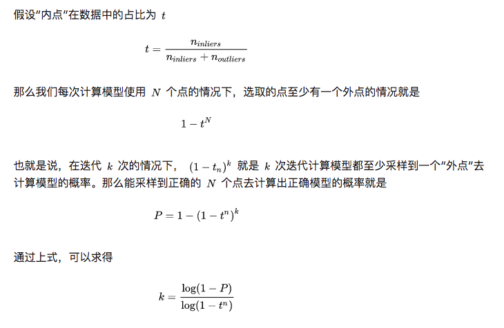

# 习题解答

**1、本书使用的C++技巧你都看懂了吗？如果有不明白的地方，使用搜索引擎补习相关的知识，包括：基于范围的for循环、lamda表达式、智能指针，设计模式中的单例模式等等。**

参考资料：

- lamda表达式：https://www.jianshu.com/p/d686ad9de817
- 智能指针：https://www.cnblogs.com/jiayayao/p/6128877.html
- 单例：https://zhuanlan.zhihu.com/p/37469260

C++技巧：

- 基于范围的for循环：操作对象为数组或容器，可以对其中的每个元素执行指定的操作。
- lamda表达式：产生了函数对象，在类中，可以重载函数调用运算符()，此时类的对象可以将具有类似函数的行为，我们称这些对象为函数对象（Function Object）或者仿函数（Functor）。表达式为[参数]{函数的定义}。
- 智能指针：原理为接受一个申请好的内存地址，构造一个保存在栈上的智能指针对象，当程序退出栈的作用域范围后，由于栈上的变量自动被销毁，智能指针内部保存的内存也就被释放掉了（除非将智能指针保存起来）。这里主要用到了shared\_ptr，shared\_ptr使用引用计数，每一个shared\_ptr的拷贝都指向相同的内存。每使用他一次，内部的引用计数加1，每析构一次，内部的引用计数减1，减为0时，删除所指向的堆内存。shared\_ptr内部的引用计数是安全的，但是对象的读取需要加锁。
- 设计模式里的单例模式：保证一个类仅有一个实例，并提供一个访问它的全局访问点，该实例被所有程序模块共享。定义方式为：1. 私有化它的构造函数，以防止外界创建单例类的对象；2. 使用类的私有静态指针变量指向类的唯一实例；3. 使用一个公有的静态方法获取该实例。

**2、在0.3版或0.4版的基础上，添加对地图进行优化的代码。或者，也可以根据PnP结果做一下三角化，消除RGB-D深度值的误差。** 待补充。

**3、观察本节代码是如何处理误匹配的。什么是RANSAC？阅读[61]或搜索相关资料来了解它。**

参考资料：https://zhuanlan.zhihu.com/p/62238520

RANSAC（RAndom SAmple Consensus），随机采样一致算法是从一组含有“外点”(outliers)的数据中正确估计数学模型参数的迭代算法。该算法无法保证结果一定最好，需要小心地选择参数使获得正确模型的概率提高。其中，迭代次数(k)可以通过理论推导得到，请见下图。

其中，有一处勘误：在“也就是说”一行，(1-t_n)^k应该为(1-t^n)^k。

其算法的基本流程为：

- 选择出可以估计出模型的最小数据集，例如对于直线拟合来说是两个点，对于计算Homography矩阵是4对匹配点；
- 使用这个数据集来计算出数据模型；
- 确定阈值，将所有数据带入这个模型，根据阈值计算出“内点”的数目；
- 比较当前模型和之前推出的最好的模型的“内点“的数量，记录最大“内点”数的模型参数和“内点”数；
- 重复前面的步骤，直到迭代结束或者当前模型已经足够好了(“内点数目大于一定数量”)。

# 参考文献

- lamda表达式：https://www.jianshu.com/p/d686ad9de817
- 智能指针：https://www.cnblogs.com/jiayayao/p/6128877.html
- 单例：https://zhuanlan.zhihu.com/p/37469260
- RANSAC：https://zhuanlan.zhihu.com/p/62238520